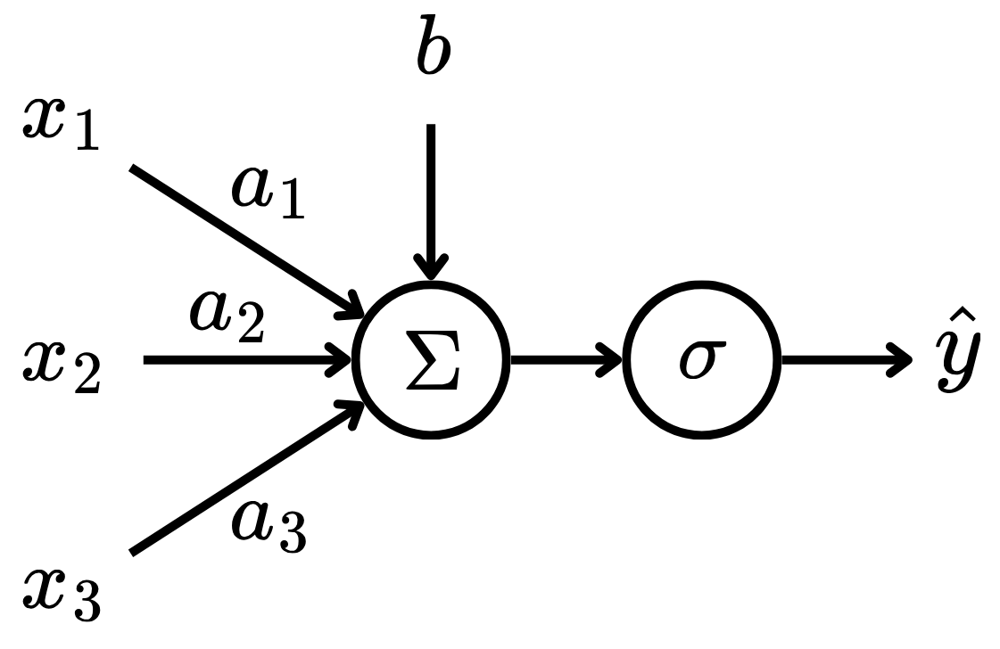
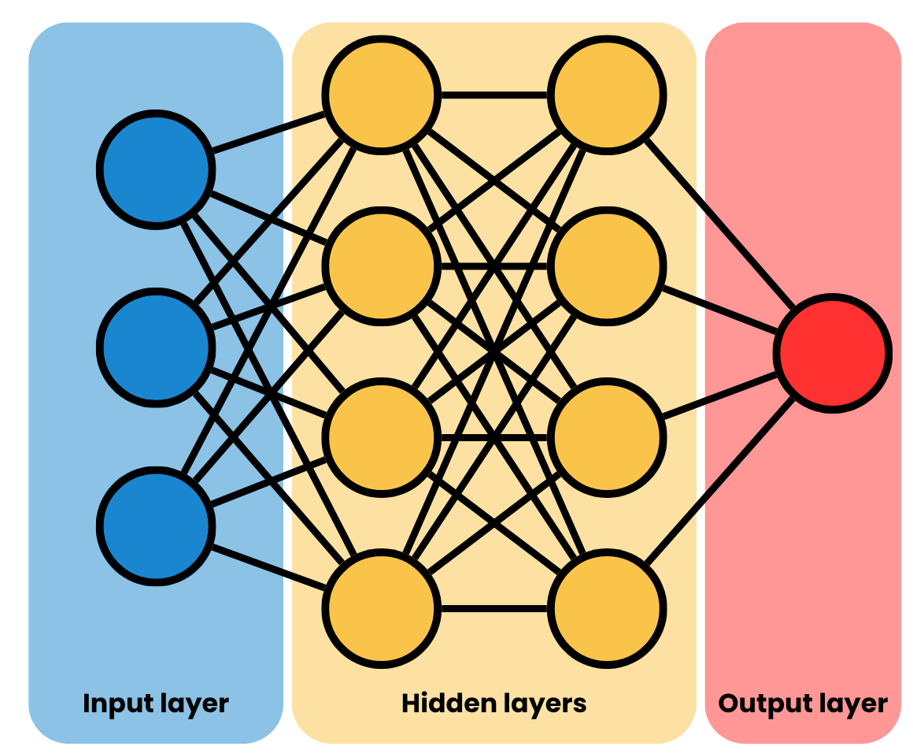

## Theory 

Deep Learning (DL) is a subarea of Machine Learning (ML) that is based on models composed of Neural Networks (NNs) [@book:dlbengio]. Here, the basis of NNs will be presented, focusing on Multilayer Perceptrons (MLPs). 

NNs were inspired by biological neural networks [@book:understanddl]. The smallest part of a NN is a neuron, which was famously modeled as a perceptron. A perceptron is a function of the form:
$$
\hat{y} = \sigma\left(b + \sum_{i=1}^n w_ix_i\right),
$$ {#eq-perceptron}
where $x_i$ are the inputs, $w_i$ are the input coefficients, $b$ is the bias, $\sigma : \mathbb R \to \mathbb R$ is the activation function and $\hat{y}$ is the output. Here, the variables $w_i$ and $b$ are referred as learnable parameters of the model.Therefore, the perceptron receives $n$ input signals and calculates their affine combination, then passes this value as input to a non-linear function. This can be visualized in @fig-perceptron.

{#fig-perceptron width=60% fig-align="center"}

To make perceptrons more complex models, one can stack multiple perceptrons in layers, creating a Multilayer Perceptron (MLP). That is, a layer of a MLP is of the form:
$$
\hat{\boldsymbol{y}} = \sigma\left(\boldsymbol{Wx} + \boldsymbol{b}\right),
$$ {#eq-2}
where $\boldsymbol{x} \in \mathbb R^n$ is the input vector, $\boldsymbol{W} \in \mathbb R^{m\times n}$ is the linear coefficient matrix, $\boldsymbol{b} \in \mathbb R^m$ is the bias vector and $\boldsymbol{\hat{y}} \in \mathbb R^m$ is the output vector. Here, the hyperparameter $m$ is the number of neurons -- or perceptrons -- in the given layer. The rows of the learnable parameters $\boldsymbol{W}$ and $\boldsymbol{b}$ play the same role as in @eq-perceptron, that is:
$$
\begin{bmatrix}
\hat{y}_1 \\
\hat{y}_2 \\
\vdots \\
\hat{y}_m
\end{bmatrix} = \sigma \left( \begin{bmatrix}
w_{11} & w_{12} & \cdots & w_{1n} \\
w_{21} & w_{22} & \cdots & w_{2n} \\
\vdots & \vdots & \ddots & \vdots \\
w_{m1} & w_{m2} & \cdots & w_{mn}
\end{bmatrix} \begin{bmatrix}
x_1 \\
x_2 \\
\vdots \\
x_n
\end{bmatrix} + \begin{bmatrix}
b_1 \\
b_2 \\
\vdots \\
b_m
\end{bmatrix} \right).
$$ {#eq-3}
Note that the activation function $\sigma : \mathbb R^m \to \mathbb R^m$ is now applied element-wise in the $\boldsymbol{Wx} + \boldsymbol{b}$ vector. 

In MLPs, layers of perceptrons are grouped sequentially in order to approximate a mapping from the input space $\mathcal X$ to the output space $\mathcal Y$, with the intermediate layers of the model being called hidden layers. That is, given a dataset $\mathcal D = \{(\boldsymbol x_i, \boldsymbol y_i)\}_{i=1}^N$ with $N$ observations, the input vector $\boldsymbol x_i \in \mathcal X$ is processed by the MLP layers until the final layer, which should yield a vector $\boldsymbol{\hat{y}}_i \approx \boldsymbol y_i \in \mathcal Y$. @fig-mlp depicts the diagram of a MLP.

{#fig-mlp width=60% fig-align="center"}

As any other ML model, the MLP has some hyperparameters, which need to be carefully tuned. The most notable ones are: 

- Number of hidden layers;
- Number of neurons per hidden layer;
- Activation function.

To train a MLP, one needs a dataset $\mathcal D = \{\boldsymbol x_i, \boldsymbol y_i\}_{i=1}^N$ of observations -- this approach is called Supervised Learning. With that, given a loss function $\mathcal L : \mathcal Y^2 \to \mathbb R$ that measures how close the prediction $\boldsymbol{\hat{y}}_i$ is to the observation $\boldsymbol y$, one updates the learnable parameters of the model -- the $\boldsymbol W$ and $\boldsymbol b$ from @eq-2 using backpropagation. This is an algorithm of the form:
$$
\boldsymbol \Theta^{(i + 1)} = \boldsymbol \Theta^{(i)} - \eta  \nabla_{\boldsymbol \Theta^{(i)}} \mathcal L.
$$ {#eq-4}
That is, in a sequence of iterations, the learnable parameters of the model in the $i$-iteration $\boldsymbol \Theta^{(i)}$ are updated using the the gradient of the loss function with respect to the learnable parameters of the MLP $\eta  \nabla_{\boldsymbol \Theta^{(i)}} \mathcal L$, considering a step size of $\eta \in \mathbb R^+$.

### Code

