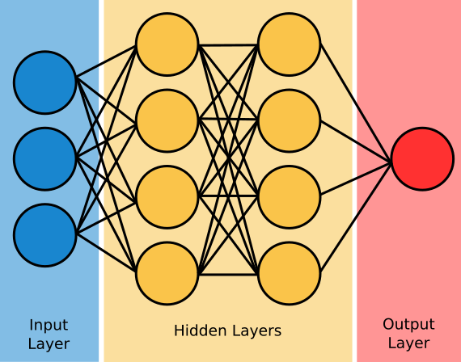

Deep Learning (DL) is a subarea of Machine Learning (ML) based on models composed of artificial Neural Networks (NNs) [@book:dlbengio]. These architectures are general function approximators inspired by biological neural processing [@book:understanddl]. The foundation of NNs began with the mathematical model of the biological neuron [@dl:neuron]. This later inspired the Perceptron [@dl:perceptron], depicted in @fig-perceptron. The Perceptron introduced learnable parameters composed of weights $\boldsymbol{w}\in\mathbb R^n$ and a bias $b\in \mathbb R$. Given an input $\boldsymbol{x} \in \mathbb R^n$, the output $\hat{y} \in \mathbb R$ of the Perceptron was defined as:
$$
\hat{y} = f\left(b + \sum_{i=1}^n w_i x_i\right) = f\left(\boldsymbol{w}^T \boldsymbol{x} + b\right),
$$ {#eq-1}
where $f(z) = \text{sgn}(z)$ was a step function. 

{#fig-perceptron width=60% fig-align="center"}

Following the Perceptron, the Adaptive Linear Element (Adaline) [@dl:adaline] introduced a way to update weights using continuous activations during training. This model defined a loss function:
$$
\mathcal L(\boldsymbol{w}, b) = \frac{1}{2} \left[y - (\boldsymbol{w}^T \boldsymbol{x} + b)\right]^2,
$$ {#eq-2}
allowing weights to be updated via the Delta Rule:
$$
\boldsymbol{w}^{(k+1)} = \boldsymbol{w}^{(k)} + \eta \left[y_i - (\boldsymbol{w}^T \boldsymbol{x} + b)\right] \boldsymbol{x}.
$$ {#eq-3}

Despite early successes, single-layer models were limited because they could only solve linearly separable problems [@dl:minsky]. To overcome this limitation, step functions were replaced with differentiable non-linear functions, enabling the development of the backpropagation algorithm [@dl:backprop]. Backpropagation employed chain rule to update parameters across stacked hidden layers, giving rise to the Multilayer Perceptron (MLP). Shortly after, the Universal Approximation Theorem [@dl:approx1; @dl:approx2] established that a feedforward network with a single hidden layer containing a finite number of neurons could approximate any continuous function on compact subsets of $\mathbb{R}^n$ under some assumptions.

The foundational building block of modern deep architectures remains the artificial neuron. A single neuron receives an input vector $\boldsymbol{x} \in \mathbb{R}^n$, computes an affine combination, and applies a non-linear activation function $\sigma : \mathbb{R} \to \mathbb{R}$:
$$
\hat{y} = \sigma\left(b + \sum_{i=1}^n w_i x_i\right) = \sigma\left(\boldsymbol{w}^T \boldsymbol{x} + b\right),
$$ {#eq-4}
where $\boldsymbol{w} \in \mathbb{R}^n$ represents the weight vector and $b \in \mathbb{R}$ denotes the scalar bias. The parameters $\boldsymbol{\Theta} = \{\boldsymbol{w}, b\}$ constitute the learnable components of the unit. To approximate more complex function, neurons are organized in parallel to form a layer. A single layer mapping an input vector $\boldsymbol{x} \in \mathbb{R}^n$ to an $m$-dimensional representation is defined as:
$$
\boldsymbol{\hat{y}} = \sigma\left(\boldsymbol{W}\boldsymbol{x} + \boldsymbol{b}\right),
$$ {#eq-5}
where $\boldsymbol{W} \in \mathbb{R}^{m \times n}$ is the linear coefficient matrix, $\boldsymbol{b} \in \mathbb{R}^m$ is the bias vector and $\boldsymbol{\hat{y}} \in \mathbb{R}^m$ is the layer output vector. Expanding this operation into matrix notation yields:
$$
\begin{bmatrix}
\hat{y}_1 \\
\hat{y}_2 \\
\vdots \\
\hat{y}_m
\end{bmatrix} = \sigma \left( \begin{bmatrix}
w_{11} & w_{12} & \cdots & w_{1n} \\
w_{21} & w_{22} & \cdots & w_{2n} \\
\vdots & \vdots & \ddots & \vdots \\
w_{m1} & w_{m2} & \cdots & w_{mn}
\end{bmatrix} \begin{bmatrix}
x_1 \\
x_2 \\
\vdots \\
x_n
\end{bmatrix} + \begin{bmatrix}
b_1 \\
b_2 \\
\vdots \\
b_m
\end{bmatrix} \right).
$$ {#eq-6}
The activation function $\sigma(\cdot)$ is applied element-wise. In an MLP, multiple layers are composed sequentially to parameterize a function $f_{\boldsymbol{\Theta}}: \mathcal{X} \to \mathcal{Y}$ that maps the input space $\mathcal{X}$ to the target space $\mathcal{Y}$. Intermediate layers between input and output are called hidden layers. @fig-mlp depicts a diagram of the MLP architecture.

{#fig-mlp width=60% fig-align="center"}

The learnable parameters are optimized in a Supervised Learning framework using a labeled dataset $\mathcal{D} = \{(\boldsymbol{x}_i, \boldsymbol{y}_i)\}_{i=1}^N$. Given a loss function $\mathcal{L} : \mathcal Y \times \mathcal Y \to \mathbb R$, the learnable parameter set $\boldsymbol{\Theta} = \{\boldsymbol{W}^{(l)}, \boldsymbol{b}^{(l)}\}_{l=1}^L$ is updated iteratively via backpropagation:
$$
\boldsymbol{\Theta}^{(k+1)} = \boldsymbol{\Theta}^{(k)} - \eta \nabla_{\boldsymbol{\Theta}^{(k)}} \mathcal{L}\left(\boldsymbol{y}, f_{\boldsymbol{\Theta}^{(k)}}(\boldsymbol{x})\right),
$$ {#eq-7}
where $k$ denotes the optimization step index and $\eta \in \mathbb{R}^+$ represents the learning rate. Finally, the MLP has some important hyperparameters that need to be tuned:

- Number of hidden layers $L$,
- Number of neurons in each hidden layer $m^{(l)}$ for $l \in \{1, \dots, L\}$,
- Activation functions for each hidden layer $\sigma^{(l)}$ for $l \in \{1, \dots, L\}$.

### Code

