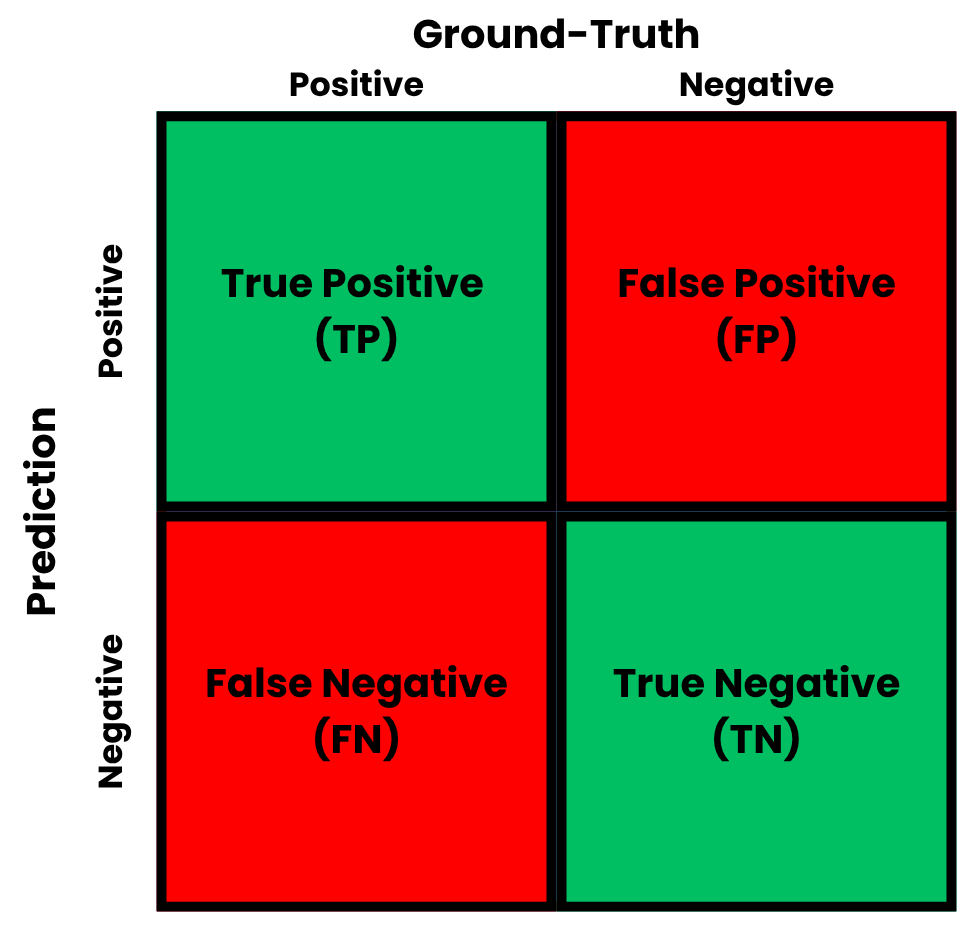

After the procedure explained in [Model Selection](model_selection.qmd), the test split is reserved for evaluating the generalization of the chosen model in unseen data. For that, functions that are usually called metrics -- not necessarily in the mathematical sense -- are used. These functions measure how close the model predictions are with respect to the ground-truth values in the test set. As each metric measures different aspects of the predictions, they should be used within the context of each problem.

## Regression

In a regression task, the targets are continuous values in $\mathbb R$. A very common metric for these problems is the Mean Absolute Error (MAE), which is given by:
$$
\text{MAE} (\boldsymbol y, \boldsymbol{\hat y}) = \frac{1}{N} \sum_{i=1}^N |y_i - \hat{y}_i|,
$$ {#eq-1}
where $\boldsymbol y \in \mathbb R^N$ is the target vector, $\boldsymbol{\hat y} \in \mathbb R^N$ is the predicted vector and $N$ is the number of observations in the test set. The MAE is not substantially affected by outliers, as the errors are calculated linearly, and is measured in the same units as the target.

Another metric for regression is the Mean Squared Error (MSE). It is given by:
$$
\text{MSE} (\boldsymbol y, \boldsymbol{\hat y}) = \frac{1}{N} \sum_{i=1}^N (y_i - \hat{y}_i)^2.
$$ {#eq-2}
In contrast to the MAE, the MSE is measured in squared target units, and is more sensitive to outliers -- as the error terms are squared. Closely related to the MSE, the Root Mean Squared Error (RMSE) is given by:
$$
\text{RMSE} (\boldsymbol y, \boldsymbol{\hat y}) = \sqrt{\frac{1}{N} \sum_{i=1}^N (y_i - \hat{y}_i)^2}.
$$ {#eq-3}
It is measured in target units, being more interpretable than MSE.

### Code: Regression



## Classification

In a classification task, the targets are in a discrete set $\{c_i\}^{C}_{i=1}$, where $C$ denotes the number of classes. A very important object in classification is the confusion matrix. It contains all pairs of predicted and ground-truth targets, which helps the comprehension from the metrics. A confusion matrix for a single class is depicted in @fig-confusion.

{#fig-confusion width=60% fig-align="center"}

To derive the metrics, components found within the confusion matrix are used. Let $\text{TP}_i$ be the number of true positives, $\text{TN}_i$ be the number of true negatives, $\text{FP}_i$ be the number of false positives, and $\text{FN}_i$ be the number of false negatives for class $i$, which contains $N_i$ observations. 

The first metric for classification is the accuracy, given by:
$$
\text{Accuracy}_i (\boldsymbol y, \boldsymbol{\hat y}) = \frac{\text{TP}_i + \text{TN}_i}{N_i},
$$ {#eq-4}
It measures the number of predictions that were correct. Although it is easy to interpret, accuracy is susceptible to class imbalance -- when classes have different proportions in the dataset. In these cases, classes with higher number of samples dominate the overall accuracy value.

To address the limitations of accuracy in imbalanced datasets, other metrics are required. One of them is precision, which measures the accuracy of the positive predictions, that is:
$$
\text{Precision}_i (\boldsymbol y, \boldsymbol{\hat y}) = \frac{\text{TP}_i}{\text{TP}_i + \text{FP}_i},
$$ {#eq-5}
Precision is important when the cost of a false positive is high. On the other hand, recall measures the amount of positive instances that were correctly identified. Recall is calculated by:
$$
\text{Recall}_i (\boldsymbol y, \boldsymbol{\hat y}) = \frac{\text{TP}_i}{\text{TP}_i + \text{FN}_i},
$$ {#eq-6}
Recall is important when the cost of a false negative is high.

Since precision and recall involve a trade-off with respect to false positives and negatives, the $F_1$ score unifies both measures. It is defined as the harmonic mean of these two metrics, given by:
$$
{\text{F}_1}_i (\boldsymbol y, \boldsymbol{\hat y}) = 2 \cdot \frac{\text{Precision}_i \cdot \text{Recall}_i}{\text{Precision}_i + 
\text{Recall}_i}.
$$ {#eq-7}
The $F_1$ score is considered to be a very robust metric for classification, even in imbalanced scenarios.

All the previous definitions involved calculating metrics for a single class. When dealing with multiple classes, it is necessary to aggregate these metrics into overall scores. For that, two main methods are considered. One of the most used options is macro-averaging, which computes a certain metric $\mathcal M$ for each class independently and then takes the unweighted arithmetic mean of these results:
$$
\text{Macro-Average}(\mathcal M, \boldsymbol y, \boldsymbol{\hat y}) = \frac{1}{C} \sum_{i=1}^C \mathcal M_i.
$$
Macro-averaging is useful to ensure that the model performs equally well on smaller or minority classes, giving equal weight to each class's performance.

### Code: Classification



## Clustering

In a clustering task, the algorithm assigns data points to a discrete set of clusters $\{\mathcal C_i\}^{C}_{i=1}$, where $C$ denotes the total number of predicted clusters. Unlike classification, clustering is an unsupervised task, meaning ground-truth labels $\boldsymbol{y}$ are often unavailable. Consequently, clustering metrics are divided into two main categories: internal metrics, which evaluate the structural properties of the clusters using only the feature space $\boldsymbol{X}$, and external metrics, which compare the predicted assignments $\boldsymbol{\hat{y}}$ against true partitions when available.

Internal metrics rely on geometry of clusters. One of them is the Silhouette Coefficient, which assesses both cluster cohesion and separation. For a specific observation $\boldsymbol{x}_i$ assigned to cluster $\mathcal{C}_A$, let $a(\boldsymbol{x}_i)$ be the mean intra-cluster distance between $\boldsymbol{x}_i$ and all other points in the same cluster:
$$
a(\boldsymbol{x}_i) = \frac{1}{|\mathcal{C}_A| - 1} \sum_{\boldsymbol{x}_j \in \mathcal{C}_A, i \neq j} d(\boldsymbol{x}_i, \boldsymbol{x}_j),
$$ {#eq-8}
where $d(\cdot, \cdot)$ denotes a distance function. Next, let $b(\boldsymbol{x}_i)$ be the mean nearest-cluster distance from $\boldsymbol{x}_i$ to the closest neighboring cluster $\mathcal{C}_B$:
$$
b(\boldsymbol{x}_i) = \min_{\mathcal{C}_B \neq \mathcal{C}_A} \frac{1}{|\mathcal{C}_B|} \sum_{\boldsymbol{x}_j \in \mathcal{C}_B} d(\boldsymbol{x}_i, \boldsymbol{x}_j).
$$ {#eq-9}

The Silhouette Coefficient $s(\boldsymbol{x}_i)$ for a single observation is given by:
$$
s(\boldsymbol{x}_i) = \frac{b(\boldsymbol{x}_i) - a(\boldsymbol{x}_i)}{\max\{a(\boldsymbol{x}_i), b(\boldsymbol{x}_i)\}}.
$$ {#eq-10}
The overall Silhouette score for a dataset is the arithmetic mean of $s(\boldsymbol{x}_i)$ across all $N$ observations. The score is bounded within the interval $[-1, 1]$, where a value close to $1$ implies well-separated, dense clusters, a value near $0$ indicates overlapping clusters, and negative values suggest incorrect sample assignments.

On the other hand, when ground-truth labels $\boldsymbol{y}$ are available, external evaluation metrics are used. Because cluster indices are arbitrary, metrics cannot directly compare labels via a standard confusion matrix. For that, the Rand Index (RI) calculates the proportion of pairs that are consistently clustered in both the true partitions and the predicted assignments. Let $a$ be the number of pairs placed in the same cluster in both partitions, and let $b$ be the number of pairs placed in different clusters in both partitions. Out of a total of $\binom{N}{2}$ possible pairs, the index is expressed as:
$$
\text{RI} = \frac{a + b}{\binom{N}{2}}.
$$ {#eq-11}
While easy to interpret, the raw Rand Index suffers from a baseline bias -- random cluster assignments yield an RI significantly greater than zero --, inflating performance on large datasets. To fix this limitation, the Adjusted Rand Index (ARI) normalizes the metric by subtracting the expected value of random permutations:
$$
\text{ARI} = \frac{\text{RI} - \mathbb E[\text{RI}]}{\max(\text{RI}) - \mathbb E[\text{RI}]}.
$$ {#eq-12}
A score of $1.0$ indicates identical cluster structures up to a permutation of labels, while a score of $0.0$ indicates a distribution consistent with random guessing.

### Code: Clustering

