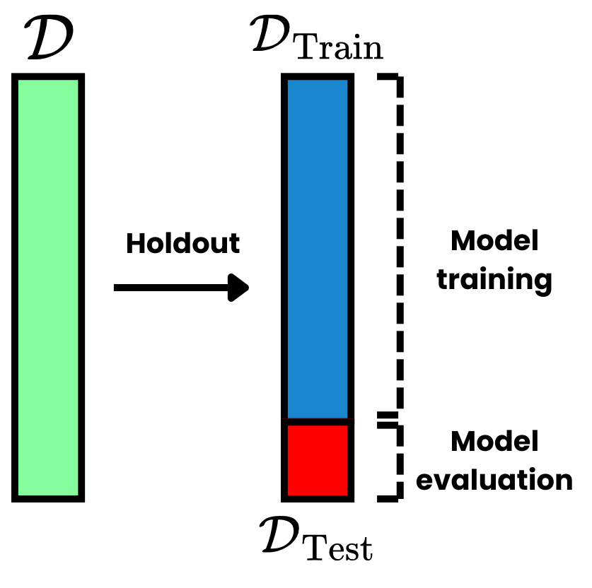
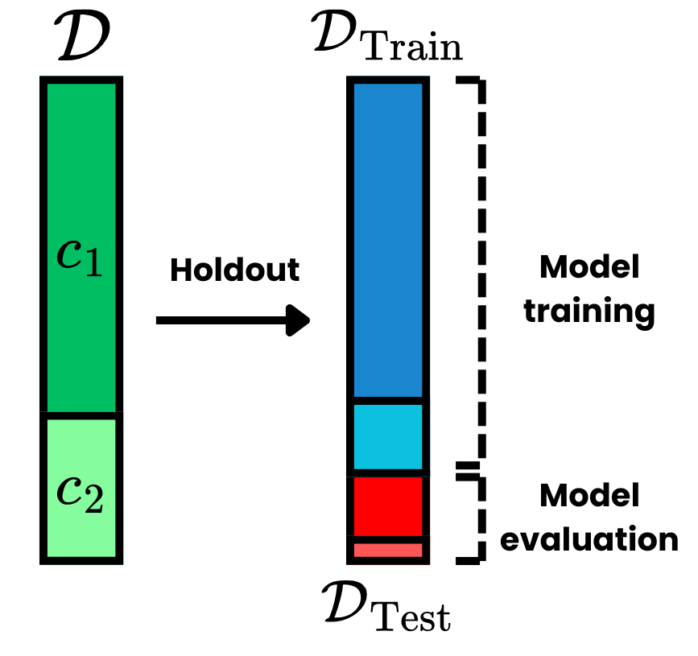
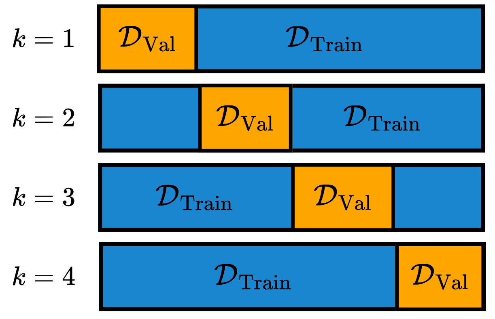

One of the most important steps in a Machine Learning (ML) pipeline is to select the best available model to deploy in the desired task. This is closely related to hyperparameter tuning (HP-tuning), which is the process of finding the best hyperparameters (HPs) of the model for the given problem. These problems involve estimating the performance of a model on unseen data -- data that was not available at training time [@ml:raschka]. For clarity, the following sub-problems are going to be defined:

- **Model evaluation**: the process of estimating how well a model generalizes on unseen data;
- **Model selection**: the process of choosing the best hyperparameters for a given model;
- **Model comparison**: comparing the performance of different models. 

## Holdout Method

The most used method for model evaluation is the holdout method. This involves splitting the dataset $\mathcal D = \{(\boldsymbol x_i, \boldsymbol y_i)\}_{i=1}^N$ with $N$ observations into two disjoint splits, called train $\mathcal D_{\text{Train}}$ and test $\mathcal D_{\text{Test}}$ split. The train split is used for training the model, while the test set is used only to evaluate the model performance. Generally, the test split contains about $10-30\%$ of the total amount of data. This method is visually depicted in @fig-holdout.

{#fig-holdout width=60% fig-align="center"}

The test set effectively simulates the behavior of the model when seeing data that was not in training. If the model generalized well, it should maintain a similar performance as it did on the training split. Note that this assumes that both splits were sampled from the same distribution, therefore, the model was able to learn patterns that are representative for that dataset. If new data is provided to the model, which possesses completely different statistics than the training data, the model is going to perform worse than expected -- this is known as the Out-Of Distribution (OOD) problem. 

A variant of the holdout method is the stratified holdout method, which is important for classification problems. In this setup, the splits can not be randomly sampled from the original dataset, as the splits need to have the same class frequencies as the original data. For that, stratified holdout makes the sampling obey this condition, which leads to the train and test split presenting approximately the same class proportions as the initial dataset. This is depicted in @fig-holdout_stratified.

{#fig-holdout_stratified width=60% fig-align="center"}

The actual metrics used for model evaluation are introduced in [Model Evaluation](model_evaluation.qmd). Note that the [Pre-Processing](pre_processing.qmd) step is always performed after the data splits have been made. When data is normalized using statistics derived from the entire dataset, splitting the observations into training and testing sets leads to data leakage. This occurs because the test set utilizes statistics calculated from the training set, potentially causing biased estimations. The best practice is to first perform the holdout method, then apply pre-processing algorithms -- such as feature selection or normalization -- using only the training set statistics, and finally apply the resulting transformations to the test set.

## $k$-fold Cross-Validation

Another sub-problem in an ML pipeline is model selection, which involves choosing the optimal set of HPs for a given model. A naive approach is using the holdout method to select the best-performing model. However, a key issue with this approach is that the performance on the test set may be biased by the specific split performed. Furthermore, there is no separate test set to evaluate model performance on unseen data, as the test set must be reserved for selecting the optimal HPs.

To address these issues, $k$-fold Cross-Validation (CV) is employed. First, the method applies the holdout technique to create a training and testing split. Then, using the training set, it generates $k$ disjoint 
sets $\mathcal D_i \subset \mathcal D_{\text{Train}}$, such that:
$$
\bigcup_{i=1}^k \mathcal D_i = D_{\text{Train}}.
$$ {#eq-1}
Subsequently, the $k$-fold CV trains the model multiple times, once for each HP configuration. For each iteration, the model is trained on $k-1$ sets, using the remaining set as the validation set -- analogous to the test set. Finally, the model yields $k$ performance values, and the mean of these values is used to estimate the model's true performance. This average performance is then used to select the best possible HP configuration from a predetermined search space.

Note that by utilizing different splits, $k$-fold CV effectively reduces split bias. Typically, $k=10$ is used for this method, although the choice depends on factors such as dataset size, computational cost, and other 
considerations. Visually, the CV process is depicted in @fig-cv.

{#fig-cv width=60% fig-align="center"}

### Code

