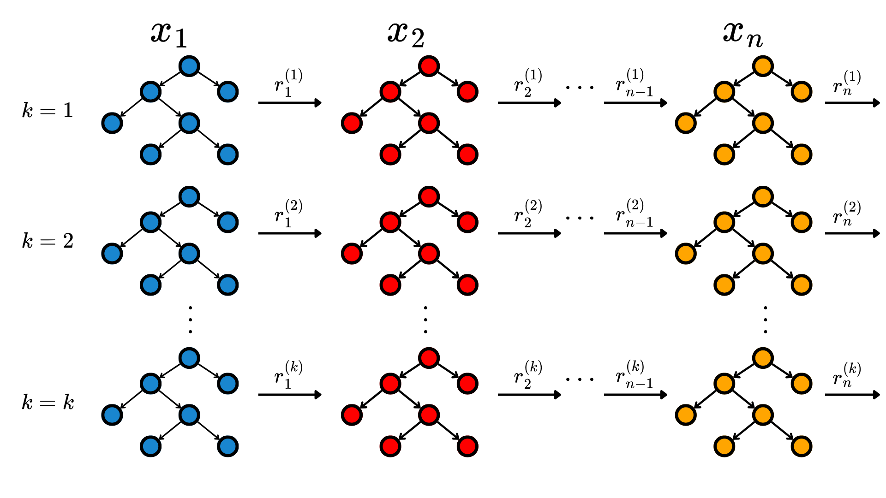

The simplest Machine Learning (ML) models are based on the assumption that the target can be expressed using a linear combination of the input features. That intuition leads to a class of models called linear models.

## Linear Regression

Let $\mathcal D = \{\boldsymbol x_i, y_i\}_{i=1}^N$ be a dataset with $N$ observations and $n$ features. The linear regression model describes the continuous target by a linear combination of the inputs, that is:
$$
\boldsymbol{\hat{y}} = \boldsymbol{Ax}^T + b,
$$ {#eq-1}
where $\boldsymbol{\hat{y}} \in \mathbb R^N$ is the vector with the predictions of the targets, $\boldsymbol x \in \mathbb R^{N\times n}$ with the features of the observations, $\boldsymbol A \in \mathbb R^n$ is the coefficient vector and $b \in \mathbb R$ is the bias term. For each observation, the model leaves residuals of the form $y_i - \hat{y}_i = \epsilon_i$. These are minimized using least-squares approaches, in order to find the best values for $\boldsymbol A$ and $b$.

Though simple, this model is intrinsically interpretable, as taking the partial derivatives with respect to each input feature yields:
$$
\frac{\partial \boldsymbol{\hat y}}{\partial x_i} = a_i.
$$ {#eq-1}
The bigger the value $a_i$, the more impact the feature $x_i$ has on the outputs. Note that this could be influenced by the scale of the features. It is possible to add regularization to the linear regression, such as $\ell_1$, known as Lasso regression, $ell_2$, known as Ridge regression, or both, known as elastic net

### Code: Linear Regression



## Logistic Regression

The logistic regression is a classification model that measures the probability of a given data point belonging to a certain class. It utilizes a sigmoid function with a threshold value, typically $P(\boldsymbol y_i=1|\boldsymbol x_i)>0.5$, for classification. The equation for logistic regression is given by:
$$
P\left(\boldsymbol{y_i} = 1 \mid \boldsymbol{x}_i \right) = \frac{1}{1+e^{-\boldsymbol{A} \boldsymbol{x}_i^T}}.
$$ {#eq-2}

### Code: Logistic Regression



## Generalized Linear Models (GLMs)

Both linear and logistic regression are specific cases of a broader framework known as Generalized Linear Models (GLMs). GLMs assume that the target variable follows a distribution from the exponential family, and that its expected value is conditioned on the input features:
$$
\mathbb{E}[y_i \mid \boldsymbol{x}_i] = \mu_i.
$$ {#eq-4}
To predict the targets, GLMs utilize a link function $g(\cdot)$ that maps the expected value of the distribution to a linear predictor:
$$
g(\mathbb{E}[y_i \mid \boldsymbol{x}_i]) = \boldsymbol{A}\boldsymbol{x}_i^T + b. 
$$ {#eq-5}
By choosing specific families of distributions and link functions -- such as an identity link for Gaussian targets or a logit link for binomial targets -- the previous models are recovered.

### Code: Generalized Linear Models



## Generalized Additive Models (GAMs)

Generalized Additive Models (GAMs) relax the strict linearity assumption of GLMs, allowing for more flexible, non-linear relationships while preserving interpretability. The general form of a GAM replaces the linear combination of features with a sum of smooth, feature-specific functions:
$$
g(\mathbb{E}[y_i \mid \boldsymbol{x}_i]) = a_0 + \sum_{j=1}^n f_j(x_{i, j}), 
$$ {#eq-6}
where $f_j$ is an arbitrary function associated with the $j$-th feature. These functions are typically modeled using basis functions, such as splines. Because the model's output is formulated as the sum of separate input functions, it remains highly interpretable. However, learning these separate non-linear functions without overfitting is a difficult task.

To address this, Explainable Boosting Machines (EBMs) [@ml:ebm] implement GAMs using cyclic gradient boosting. EBMs iteratively fit shallow decision trees to each feature independently, learning to correct the residual errors of previous trees. That is, at the $i$-th iteration, the tree associated to the $j$-th feature is trained to predict the residual $r_{j-1}^{(i)}$, in a iterative way. As each tree is restricted to a single feature, it is considered a weak learner, that iteratively refines the corresponding function $f_j$. After several iterations, the model produces an accurate yet transparent representation of the additive functions. @fig-ebm depicts the diagram of an EBM.

{#fig-ebm width=60% fig-align="center"}

### Code: Generalized Linear Models

