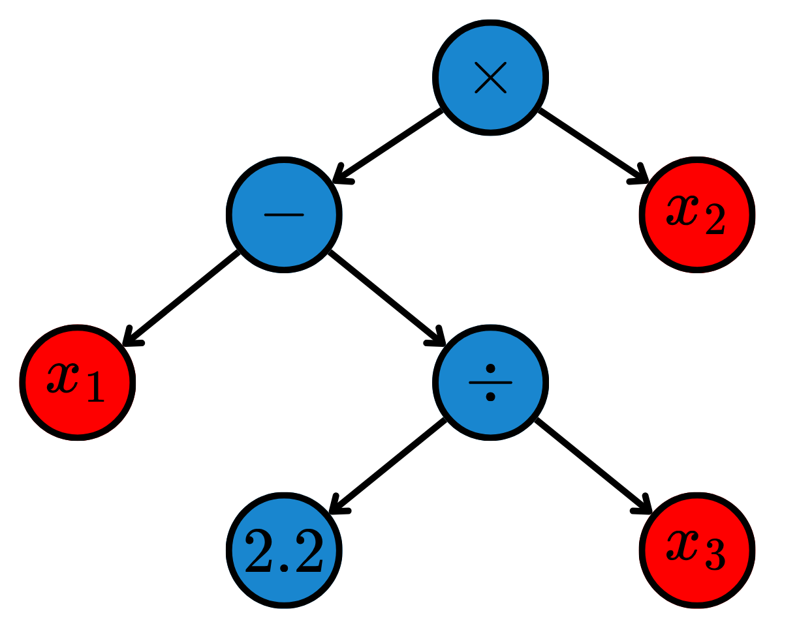

Symbolic models seek to find mathematical expressions that best describe the training data. To do that, these models use Evolutionary Algorithms (EA) -- such as Genetic Algorithms (GAs) -- to search in a symbolical space.

## Symbolic Regression (SR)

While standard regression algorithms assume a specific mathematical structure and optimize its numerical parameters, Symbolic Regression (SR) takes a different approach. It searches the space of mathematical expressions to simultaneously discover both the structure of the model and its parameters.

Given a training set $\mathcal{D}^{(\text{Train})} = \{(\boldsymbol{x}_i^{(\text{Train})}, y_i^{(\text{Train})})\}_{i=1}^N$, SR seeks an optimal function $f$ from a space of possible mathematical expressions $\mathcal{E}$. This space is constructed by combining mathematical primitives, which include the features, constants and a predefined set of operators. They are combined in trees, such as depicted in @fig-sr.

{#fig-sr width=60% fig-align="center"}

The optimization objective is to find the expression $f \in \mathcal{E}$ that minimizes a given loss function $\mathcal L$ while simultaneously penalizing the complexity of the expression $C(f)$ to prevent overfitting and encourage interpretability:
$$
\hat{f} = \underset{f \in \mathcal{E}}{\arg\min} \  \sum_{i=1}^N \mathcal L\left(y_i^{(\text{Train})}, f(\boldsymbol{x}_i^{(\text{Train})})\right) + \lambda C(f),
$$ {#eq-9}
where $\lambda$ controls the tradeoff between accuracy and simplicity. The complexity $C(f)$ is often defined as the number of nodes in the expression tree.

Because the search space $\mathcal{E}$ is discrete, infinite, and non-differentiable, SR uses EAs to search the best possible functions. After the training, the model is described by a single mathematical equation, making it a highly interpretable model.

### Code: Symbolic Regression

