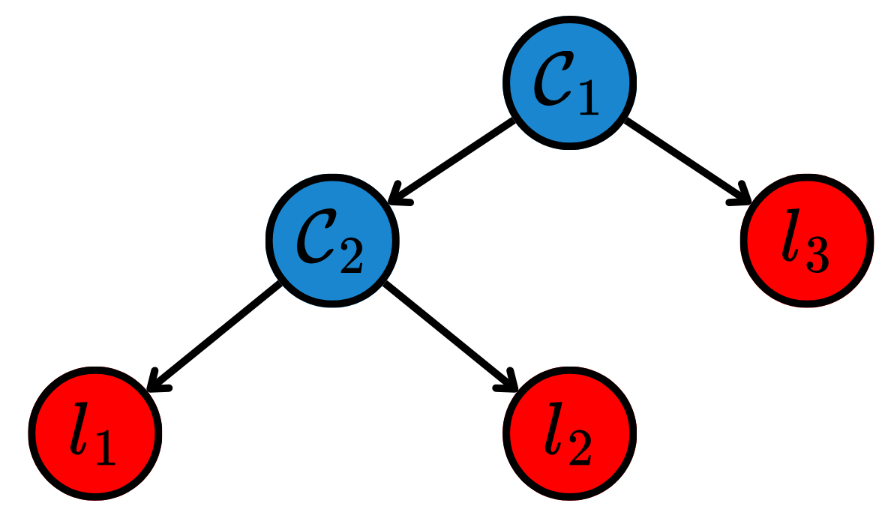
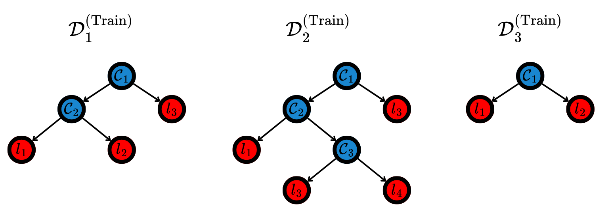

In [Linear Models](../linear_models/linear_models.qmd), the Explainable Boosting Machine (EBM) algorithm was presented. As mentioned, it used decision trees to approximate the functions from the Generalized Additive Models (GAMs) using decision trees. Here, more tree-based models are going to be introduced.

## Decision Tree (DT)

A Decision Tree (DT) is formally defined as a directed acyclic graph -- also called a tree --, possessing two types of nodes: decision and leaf nodes. Decision nodes present conditional tests based on a certain feature. Observations that satisfy the condition moves to the left child node, while the other go to the right child. Each decision node separates the observations in two subsets, doing the same in feature space. On the other hand, leaf nodes represent a certain region in feature space, without having child nodes. They are at the end of the trees and represent the regions formed by specific paths generated by following the decision nodes. @fig-dt depicts a DT.

{#fig-dt width=60% fig-align="center"}

During training, the decision nodes in the DT are formed by maximizing the purity of its child nodes. The intuition is that each conditional test should separate the data as much as possible, effectively grouping observations that are present in similar regions in space. To measure how pure a node is, impurity functions are used. For classification, one of the most common impurity functions is the entropy of the data. Let the class proportions in a certain node $\mathcal C_i$ be $\{p_i\}_{i=1}^n$. The entropy $\mathcal H$ of that node is defined as:
$$
\mathcal H(\mathcal C) = -\sum_{i=1}^{n} p_i \log p_i.
$$ {#eq-1}
Note that this function is maximized when the proportion of all classes is the same, and minimized when there is only a single class in the node. The splits are chosen so that the information gain is maximized, being defined as:
$$
\mathcal I(\mathcal C_i, \mathcal C_j) = \mathcal H(\mathcal C_i) - \mathcal H(\mathcal C_i \mid \mathcal C_j),
$$ {#eq-2}
where $\mathcal H(\mathcal C_i \mid \mathcal C_j)$ denotes the conditional entropy after the split made in $\mathcal C_j$. The splits that maximize the function $\mathcal I$ produce the purest child nodes. For regression, the same ideia is valid, though the impurity function to be minimized is generally the variance of the targets.

After training, the inference uses an aggregation function $g: \mathbb R^{L\times n} \to \mathbb R$ to combine the targets from the $L$ training observations that lied in each node. This combined value is set as the prediction of the new data points. 

Note that DTs do not assume any distribution for the data, and are also invariant to transformations that do not change the sequence of the elements in any given interval. Another important fact is that by maximizing purity of the child nodes, it automatically selects the most important attributes for predicting the target -- as the first ones are the ones that most separate the observations.

### Code: Decision Tree



## Random Forest (RF)

A DT is a model with low bias and high variance, overfitting the training data. To avoid this, the Random Forest (RF) [@ml:rf] model ensembles various DTs, aggregating their predictions. This increases bias and decreases variance, leading to more robust models.

RF operates through a process called Bootstrap Aggregating -- also know as bagging. Multiple subsets of the training data $\mathcal D^{(\text{Train})}_{i}\subseteq \mathcal D^{(\text{Train})}$ are created by drawing random samples with replacement. Each subset is used to train a separate decision tree. During the construction of each tree, the algorithm is not allowed to choose from all features. Instead, it must select from a random subset of features, forcing the trees to be different. Then, each tree is grown to its maximum depth, to ensure each one has low bias. Finally, the predictions of each tree are combined using a suitable operator. @fig-rf depicts a RF.

{#fig-rf width=60% fig-align="center"}

### Code: Random Forest



## Gradient Boosting Machines (GBMs)

Unlike Random Forests, which rely on the independence of trees to reduce variance, Gradient Boosting Machines (GBMs) build an ensemble of decision trees sequentially. Each new tree is designed to correct the residuals of the preceding ensemble. This approach is framed as a functional gradient descent, where the model minimizes a loss function $\mathcal L(y, \mathcal F(\boldsymbol{x}))$ by adding weak learners that point in the direction of the negative gradient.

Let $\mathcal F_0(\boldsymbol{x})$ be an initial constant prediction. For each iteration $t = \{1, \dots, T\}$, the algorithm calculates the pseudo-residuals $r_{i}^{(t)}$, which are the negative gradients of the loss function with respect to the current predictions:
$$
r_{i}^{(t)} = -\left[ \frac{\partial \mathcal L(y_i, \mathcal F_{t-1}(\boldsymbol{x}_i))}{\partial \mathcal F_{t-1}(\boldsymbol{x}_i)} \right].
$$ {#eq-3}
A new weak learner $h_t(\boldsymbol{x})$ -- typically a decision tree -- is then trained to fit these residuals. The ensemble is updated as:
$$
\mathcal F_t(\boldsymbol{x}) = \mathcal F_{t-1}(\boldsymbol{x}) + \eta \cdot h_t(\boldsymbol{x}),
$$ {#eq-4}
where $\eta \in (0, 1]$ is the learning rate, which controls the contribution of each tree to prevent overfitting. There are several implementations of GBMs, such as XGBoost [@ml:xgboost], LightGBM [@ml:lightgbm] and CatBoost [@ml:catboost].

### Code: Gradient Boosting

