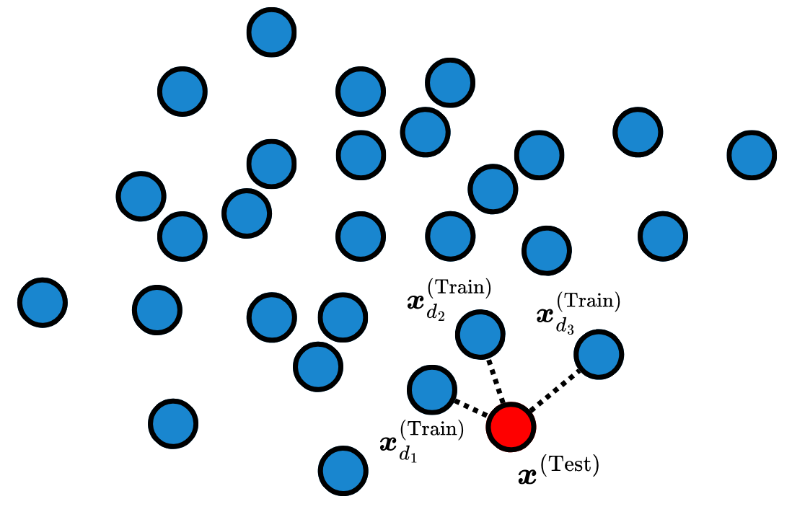
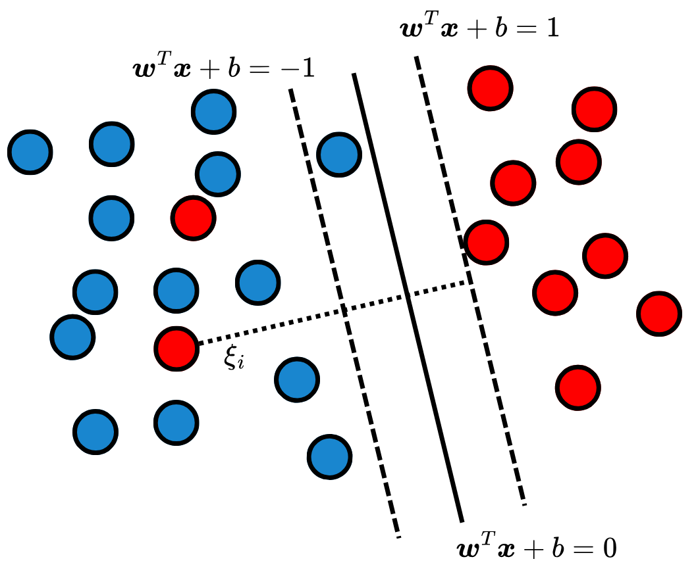

After [Linear Models](linear_models.qmd), another important class of Machine Learning (ML) models is distance and margin algorithms. The distance-based models assume that observations that are close close in feature space are also close on target space. That is, observations that are similar have similar target values. Closely related to these algorithms, margin models are designed to separate observations by finding decision boundaries that maximizes the margins, which are the distances between the boundaries and the closest data points.

## $k$-Nearest Neighbors ($k$-NN)

The $k$-Nearest Neighbors ($k$-NN) [@ml:knn] algorithm is a distance-based algorithm. This models is a lazy learner, meaning it does not require training. $k$-NN stores tha training data, and at inference time, uses the closest $k$ observations to predict the target of a new data point. The algorithm has three major hyperparameters (HPs): the distance function $d: \mathbb R^{n\times n} \to \mathbb R_{\geq 0}$, the number of neighbors $k$ and the aggregation function $g: \mathbb R^{k\times n} \to \mathbb R_{\geq 0}$. The distance function determines how to calculate distance in feature space, while $k$ is the number of neighbors used to calculate the targets during inference. Lastly, the aggregation function combines the $k$ closest neighbors to generate the prediction. That is, for a test data $\boldsymbol x^{(\text{Test})} \in \mathcal D_{\text{Test}}$ its prediction $\hat y^{(\text{Test})}$ is given by:
$$
\hat{y}^{(\text{Test})} = g\left(\boldsymbol{x}^{(\text{Train})}_{d_1}, \boldsymbol{x}^{(\text{Train})}_{d_2}, \dots, \boldsymbol{x}^{(\text{Train})}_{d_k}\right),
$$ {#eq-1}
where $\boldsymbol{x}^{(\text{Train})}_{d_i}$ is the $i$-th closest observation to $\boldsymbol{x}^{(\text{Test})}$ in the training data. according to the distance function $d$. @fig-knn depicts a scheme of $k$-NN during inference.

{#fig-knn width=60% fig-align="center"}

The HPs need to be carefully chosen so that the model does not suffer from the dimensionality curse, and balance its bias and variance tradeoff. It is also important to note that this algorithm relies on the order of magnitude of the input features, so normalization -- as explained in [Pre-Processing](../pipeline/pre_processing.qmd) -- is important to prevent undesired behavior. 

### Code: $k$-Nearest Neighbors



## Support Vector Machines (SVM)

Support Vector Machines (SVMs) [@ml:svm] are margin-based classifiers. In a binary classification setting, an SVM seeks a linear decision boundary that separates the classes while maximizing the margin. The margin is defined as the perpendicular distance from the decision boundary to the closest training observations, which are known as the support vectors.

Let the separating hyperplane be defined by $\boldsymbol{w}^T\boldsymbol{x} + b = 0$, where $\boldsymbol{w} \in \mathbb R^n$ is the normal weight vector and $b \in \mathbb R$ is the bias. The margin distance is given by $\frac{1}{\|\boldsymbol{w}\|}$, and the greater this value is, the more separated are the two classes. To maximize this margin, the algorithm minimizes the squared norm of the weights:
$$
\min_{\boldsymbol{w}, b} \frac{1}{2} ||\boldsymbol{w}||^2_2
$$ {#eq-2}
subject to the strict classification constraints:
$$
y_i(\boldsymbol{w}^T\boldsymbol{x}_i + b) \geq 1, \quad \forall i = 1, \dots, N,
$$ {#eq-3}
where $y_i\in\{-1, 1\}$.

In most scenarios, the dataset $\mathcal{D}$ is not perfectly linearly separable -- making the previous problem mathematically infeasible. To address overlapping classes, the optimization problem is relaxed through the introduction of slack variables $\xi_i \geq 0$, which allow for margin violations and misclassifications. The objective function becomes:
$$
\min_{\boldsymbol{w}, b, \boldsymbol{\xi}} \frac{1}{2} ||\boldsymbol{w}||^2 + C \sum_{i=1}^N \xi_i,
$$ {#eq-4}
subject to $y_i(\boldsymbol{w}^T\boldsymbol{x}_i + b) \geq 1 - \xi_i$. The hyperparameter $C > 0$ controls the tradeoff between maximizing the margin and minimizing the classification errors. A smaller $C$ encourages a wider margin with more violations, while a larger $C$ heavily penalizes misclassifications, leading to a narrower margin. @fig-svm depicts an example of the SVM decision boundaries.

{#fig-svm width=60% fig-align="center"}

SVMs can be extended to model non-linear relationships. To do that, the idea is to transform the data into a higher-dimensional space in which the classes can be linearly separated. Instead of directly applying this transformation -- which would cause a massive computational cost -- SVMs utilize the kernel trick. This allows the SVM to implicitly calculate the dot product in the high-dimensional space using only the original, low-dimensional coordinates. A widely used choice is the Radial Basis Function (RBF) kernel:
$$
K(\boldsymbol{x}_i, \boldsymbol{x}_j) = \exp\left(-\gamma ||\boldsymbol{x}_i - \boldsymbol{x}_j||^2\right),
$$ {#eq-9}
where $\gamma > 0$ regulates the influence of a single training example. 

### Code: Support Vector Machine

